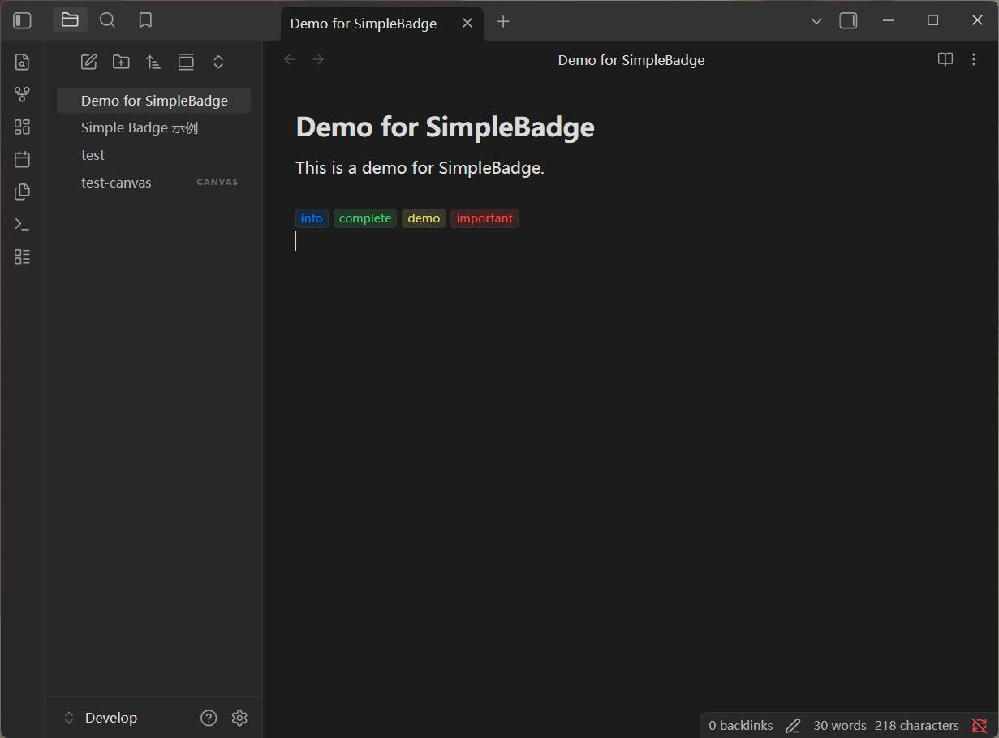
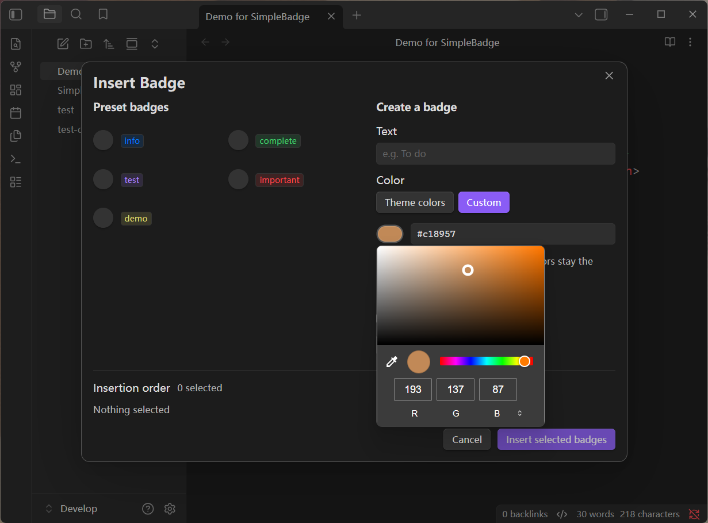
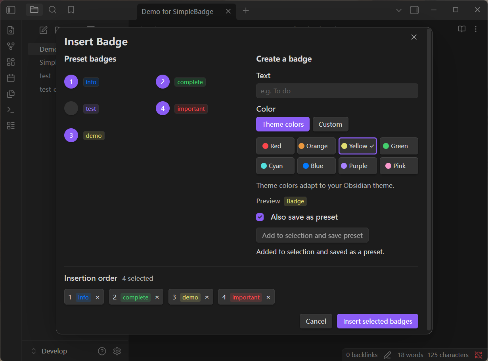
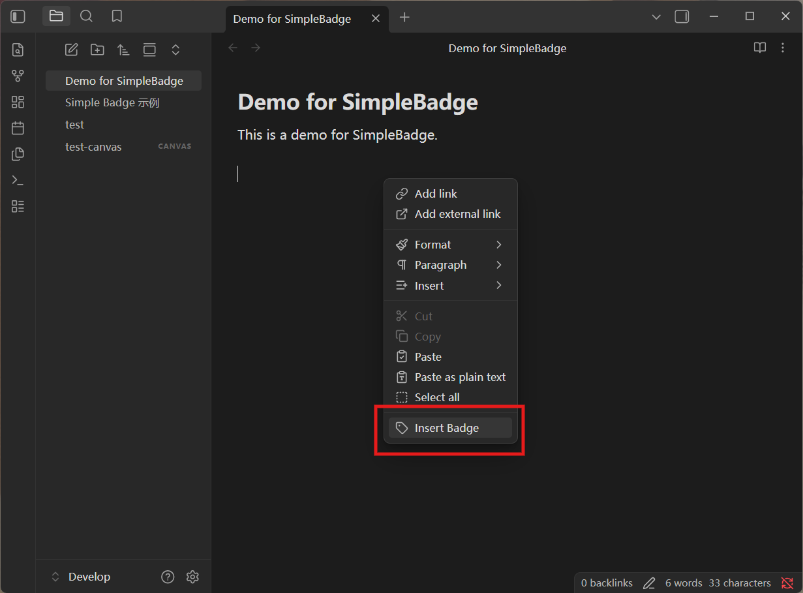
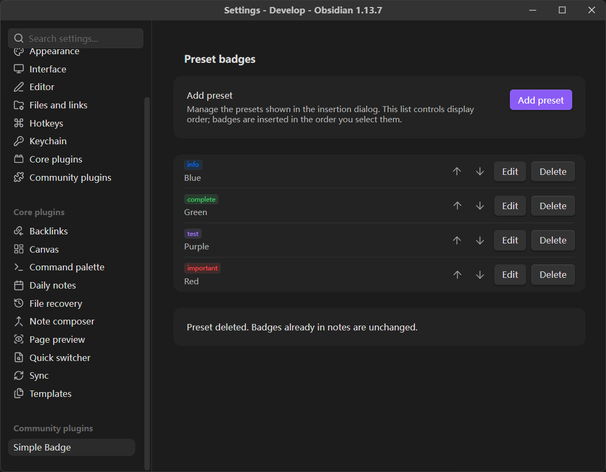
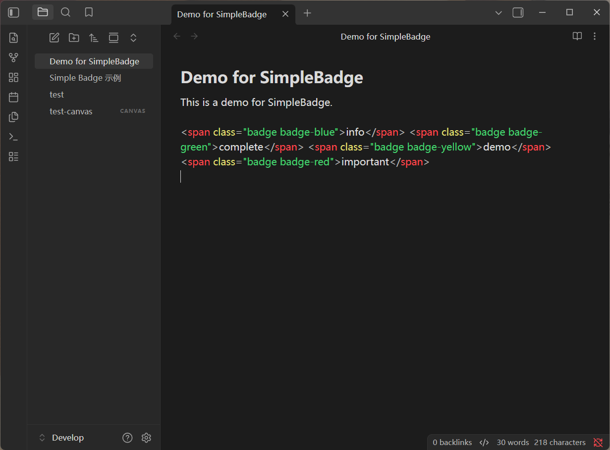

# Simple Badge

English | [简体中文](README.zh-CN.md)

Right-click in an Obsidian Markdown editor and choose **Insert Badge** to preview, create, and insert multiple text badges in the order you select them. Current version: **0.5.0**.

```html
<span class="badge badge-red">Important</span> <span class="badge badge-green">Done</span>
```

Choose from eight theme colors or pick any custom HEX color. Sizing, rounded corners, borders, and the 15% tinted background remain fixed. No separate CSS snippet is required.

The interface follows Obsidian's language: Chinese language settings use Simplified Chinese, and all other languages use English. This includes menus, dialogs, settings, color names, status messages, and accessibility labels.

To use the English interface, choose **English** under **Settings → General → Language**, then restart Obsidian when prompted. Saved preset text is preserved when you switch languages. This guide includes the corresponding Chinese labels for plugin controls.



## Choose a color

The same color selector is available when creating a badge in the insertion dialog and when adding or editing a preset in settings.

- **Theme colors (主题色)**: red, orange, yellow, green, cyan, blue, purple, and pink. Swatches show the actual theme colors, and a checkmark identifies the selection. These colors adapt to your Obsidian theme.
- **Custom (自定义)**: click the color swatch to open the native picker, or type a HEX color. The picker, input, and badge preview stay in sync. A custom color keeps its exact value across themes.
- Accepts `#RRGGBB` and `#RGB`, ignoring case and surrounding whitespace. Values are saved in lowercase six-digit form, so `#ABC` and `#aabbcc` represent the same color. Alpha values and other CSS color expressions are not accepted.
- While a HEX value is incomplete or invalid, the preview retains the last valid color and saving or adding that draft is disabled. Leaving the field shows an inline error. Your typed value is not expanded until you leave the field, so you can enter all six digits normally.

Theme colors keep the existing class-only HTML. Custom badges include their color in a CSS variable, so the value travels with the span when copied between notes:

```html
<span class="badge badge-custom" style="--simple-badge-color: #e67e22;">Important</span>
```

The plugin stylesheet supplies the shared appearance for both formats.



## Insert multiple badges

1. Right-click at the desired position in a Markdown editor and choose **Insert Badge (插入 Badge)**.
2. Presets appear as rendered badges on the left. Click the circular button before a badge to select it. The button displays its selection order, starting at 1.
3. Select more presets as needed. Clicking a selected button deselects that badge and renumbers the remaining selections. Selecting it again adds it to the end.
4. The **Insertion order (插入顺序)** area below shows the current selection. Click an item there to remove it.
5. Click **Insert selected badges (插入选定 Badge)** in the bottom-right corner to insert complete span elements, with one space between adjacent spans.

A fresh insertion session starts with no badges selected. Clicking Cancel or pressing Esc closes the dialog without inserting text.



## Create a badge while inserting

Enter text and choose a color on the right side of the dialog. The preview updates immediately.

- Click **Add to selection (加入本次选择)** to append a temporary badge to the current insertion order.
- Check **Also save as preset (同时保存为预设)**, then click **Add to selection and save preset (加入选择并保存预设)** to also save the badge in the preset list for future use.
- Saving takes effect immediately. Canceling the insertion dialog afterward does not undo a preset that has already been saved.
- Text cannot be empty, and leading and trailing whitespace is trimmed. Text is treated as plain text; `&`, `<`, and `>` are automatically escaped in the generated HTML.
- Badges with identical text and color reuse an existing entry and are not added to the same selection more than once. Badges with the same text but different colors can be saved separately.



## Manage presets

Open Obsidian **Settings → Community plugins → Installed plugins → ⋮ next to Simple Badge → Settings**. You can also select **Simple Badge** under the Community plugins section in the settings sidebar. The exact location and appearance of these controls may vary by Obsidian version.

The settings page lets you add, edit, delete, and move presets up or down. Every entry shows a rendered preview. Preset order controls how badges are displayed; insertion order always follows your selection order in the insertion dialog.

On Obsidian 1.13.0 and later, settings search can find the add-preset and span-import actions, and individual presets by their text or color. Search for `span` to find the import action. Results update when presets change. Obsidian 1.8.7–1.12.x uses the standard settings page without search integration.

On first use, the plugin provides four example presets in the interface language: Information (blue), Done (green), Note (purple), and Important (red) in English; 信息、完成、备注、重要 in Chinese. You can edit or delete all of them. Deliberately clearing the list does not restore the defaults. Existing saved presets are never translated automatically.

Presets are stored in `.obsidian/plugins/simple-badge/data.json` in the current vault. If saving fails, an error is displayed and your input is retained so you can retry. If the configuration is invalid or uses an unsupported version, the plugin asks you to check the file instead of overwriting it with defaults.

Versions 0.4.0 and 0.5.0 read both version 1 and version 2 preset data. Existing IDs, text, colors, and order are preserved; the next successful preset save writes version 2. Loading alone does not rewrite the file. Version 0.3.x cannot read version 2 data, so keep a backup of `data.json` if you intend to downgrade.

Editing or deleting a preset does not change spans already inserted in notes or silently change selections in an insertion dialog that is already open.



## Add presets from span code

To reuse badges from another vault, copy their complete span code from the Markdown source and open **Settings → Simple Badge**. Directly below **Add preset**, the **Add presets from span code (从 span 代码添加预设)** row has an **Add presets (添加预设)** button.

1. Open the import dialog and paste one or more spans, separated by spaces or newlines. An enclosing Markdown code block with no language or with `html` is also accepted.
2. Check the rendered previews and the counts of new and duplicate badges.
3. Click **Add presets** to append all new badges in their pasted order. They are immediately available in the insertion dialog and can be edited like any other preset.

For example, paste both lines to add a theme badge and a custom-color badge:

```html
<span class="badge badge-red">Important</span>
<span class="badge badge-custom" style="--simple-badge-color: #e67e22;">Review &amp; approve</span>
```

Duplicates with the same text and color are skipped, including duplicates within the pasted batch. Equivalent HEX values such as `#ABC` and `#aabbcc` count as the same color. Existing presets keep their IDs and order. If every badge is already present, adding is disabled.

The importer accepts Simple Badge's eight theme color classes and its custom HEX format. Text is decoded from HTML entities, so `&amp;` becomes `&` and `&lt;` becomes literal `<` text. Badge text must be nonempty and single-line. Other HTML elements, extra attributes, and other CSS declarations are rejected; this feature imports badge text and color, not arbitrary CSS snippets or theme settings. Theme colors follow the destination vault's theme, while custom HEX colors retain their specified values.

An invalid span shows an inline error with its position in the batch, and nothing is added until the entire input is valid. Canceling leaves presets unchanged. Each import accepts up to 500 badges and 200,000 characters. Saving uses one batch operation; if it fails, the input is retained for retry.

## Editor behavior

- Supports the Markdown editor context menu in Source mode and Live Preview on desktop, including Canvas text cards. Double-click a Canvas text card to edit it, then right-click inside its text area and choose **Insert Badge**. The card's outer context menu and the canvas background menu do not contain this action.
- Uses the primary cursor position captured when the context menu opens. If text is selected, the original text is preserved and badges are inserted at the end of the primary selection.
- Adds one space between adjacent spans, without adding other spaces, line breaks, or placeholder text.
- Places the cursor after the entire batch. A single undo or redo applies to the whole batch.
- If the note changes after the dialog opens, or the original editor is no longer valid, attempting to insert prompts you to **Choose a new position (重新定位)**. Click that button, then right-click at a new position to reopen the insertion dialog with your selection and draft preserved.
- The saved insertion session is held only in memory. Canceling the reopened dialog, disabling the plugin, or exiting Obsidian ends that session.
- Reading view renders the badges. Editing modes follow Obsidian's native inline HTML behavior.
- Disabling the plugin leaves the HTML in your notes. To retain the styling independently, copy the `.badge` rule, eight theme color rules, and `.badge-custom` rule at the beginning of `styles.css` into a CSS snippet and enable it.



## Development and testing

Requires Node.js 20.19+, 22.13+, or 24+ and pnpm.

```sh
pnpm install
pnpm lint
pnpm build
pnpm test
```

`pnpm dev` watches the source and rebuilds it. `pnpm typecheck` runs type checking separately. Watch mode does not automatically copy files to the vault or reload the plugin.

The 39 automated tests cover selection order and snapshots, HTML escaping, batch editor transactions, preset management, concurrent saves and failure recovery, language handling, malformed configuration rejection, and Canvas insertion targets. Color tests cover HEX normalization and invalid input, all eight translated theme colors, mixed HTML output, safe DOM previews, equivalent-color duplicates, version 1 migration, and version 2 save failures. Import tests cover HTML round trips and entity decoding, malformed input, localized errors, input limits, duplicate counts, ordered batch saves, reload persistence, unchanged imports, and concurrent or failed imports. `pnpm lint` runs the official Obsidian ESLint recommended rules with zero warnings allowed.

The following behaviors have also been verified in the Develop vault on Windows with Obsidian **1.13.7**: numbered selection, renumbering after deselection, mixed insertion of temporary and saved badges, HTML escaping, undo and redo of a complete batch, preset management in settings, preset persistence after re-enabling the plugin, a single context-menu entry after reloading, and preserving a selection while choosing a new insertion position after the note changes. Examples remain in `Simple Badge 示例.md` in that test vault.

Version 0.3.0 was also checked with Obsidian set to English: the context menu, insertion dialog, selection count, success messages, settings page, and preset editor displayed English correctly. Inserting an English temporary badge together with an existing Chinese preset preserved selection order and escaped special characters; a single undo restored the original note. Switching back to Chinese restored the Chinese interface. The note and preset data files matched their original hashes after testing.

Version 0.3.1 was checked in Obsidian 1.13.7 for settings search, navigating to a result, preset creation, reordering, editing, and deletion. Renamed presets appeared in search immediately; deleted presets disappeared. The note and preset data files matched their original hashes after removing the test entry.

Version 0.3.2 was checked in the Develop vault's `test-canvas.canvas` on Obsidian 1.13.7. The text-card editor menu opened the insertion dialog, and two selected presets were inserted in selection order with one space between spans. The badges rendered in the card and persisted to the Canvas file. A single undo restored the original empty card.

Version 0.4.0 was checked on Obsidian 1.13.7 for native color picking (including updates while the picker stays open), incremental HEX entry, invalid input, shorthand normalization, creating and editing custom presets, and restoring them after re-enabling the plugin. Mixed custom and theme badges rendered in Markdown Live Preview, Reading view, and Canvas cards. Canvas was also checked in light and dark modes. Batch undo restored both test files to their original hashes.

Version 0.5.0 was checked in the English interface on Obsidian 1.13.7 for the new settings row, rendered import previews, mixed theme and custom HEX batches, duplicate counts, entity decoding, invalid second-badge errors, canceling, settings search, and persistence after re-enabling the plugin. After removing the temporary test presets, `data.json`, `test.md`, and `test-canvas.canvas` matched their pre-test hashes. Chinese import messages are covered by automated tests.

The minimum supported Obsidian version is 1.8.7, matching the public `getLanguage()` API used for automatic language detection. The color picker does not require a newer API. Newer settings APIs are guarded with `requireApiVersion("1.13.0")`, with an imperative settings fallback for earlier supported versions. That older-version path, third-party themes, and mobile have not been verified through actual UI testing; the plugin currently declares desktop-only support. Older embedded browsers that do not support `color-mix()` retain the base badge background.

## Deployment and installation

```sh
pnpm build
pnpm run deploy:dev
```

These commands deploy `main.js`, `manifest.json`, and `styles.css` to the configured development vault:

```text
D:\Notes\Develop\.obsidian\plugins\simple-badge
```

For another vault:

```sh
pnpm run deploy "D:/path/to/vault"
```

Enable **Simple Badge** in Obsidian under **Settings → Community plugins**. After updating, disable and re-enable the plugin to reload it.

Alternatively, extract the three files from `simple-badge-0.5.0.zip` into `.obsidian/plugins/simple-badge/` in the target vault, then enable the plugin. Preserve the existing `data.json` when updating.

The deployment script copies only the three plugin files. It does not modify preset data, the enabled-plugin list, or other plugin settings.

## Source layout

- `src/main.ts`: Context-menu entry, editor position validation, and plugin lifecycle.
- `src/editor-target.ts`: Captures the original editor and cursor and validates the insertion target for notes and embedded editors.
- `src/i18n.ts`: English and Simplified Chinese translations and language resolution.
- `src/insert-modal.ts`: Preset selection, badge creation, and batch insertion dialog.
- `src/settings.ts`: Obsidian settings page and preset editor dialog.
- `src/import-modal.ts`: Span import dialog, validation feedback, and rendered previews.
- `src/span-import.ts`: Strict parsing of complete badge spans and HTML entity decoding.
- `src/badge-form.ts`: Shared text, color, and preview form used by both dialogs.
- `src/color-picker.ts`: Shared theme swatches, native color picker, and HEX input with validation.
- `src/model.ts`: Preset types, configuration validation, selection order, and HTML serialization.
- `src/preset-store.ts`: Preset operations and serialized persistence.
- `src/badge.ts`: Safe DOM previews and batch editor transactions.
- `styles.css`: Fixed badge styles and plugin interface layout.
- `tests/core.test.mjs`: Core behavior tests.
- `tests/import.test.mjs`: Span parsing and batch import tests, included in the same test command.
- `scripts/deploy.mjs`: Copies build artifacts to a specified vault.
- `THIRD-PARTY-NOTICES.txt`: License for the bundled HTML entity decoder; also included in the generated `main.js`.
